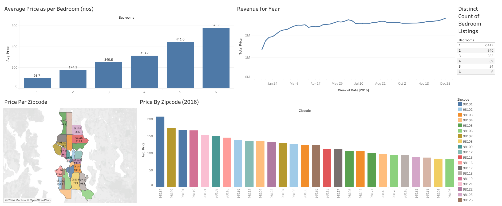

# Overview
Hi, this is my analysis for the Airbnbs in Seattle, WA in 2016. The primary objective of this analysis is to explore the pricing patterns, revenue trends, and the distribution of rental properties across different neighborhoods and bedroom configurations. By leveraging data visualizations, the analysis seeks to provide a comprehensive understanding of how various factors, such as the number of bedrooms and geographical location, influence rental prices. This analysis is intended to guide potential investors, property managers, and other stakeholders in making informed decisions regarding property listings, pricing strategies, and market positioning within the Seattle Airbnb market.


# The Questions

1. What is the relationship between the number of bedrooms and the average rental price?

2. How does revenue from Airbnb listings in Seattle fluctuate over the year?

3. What is the distribution of Airbnb listings based on the number of bedrooms?

4. How does the average rental price vary across different zip codes in Seattle?

5. What are the specific price differences by zip code for the year 2016?

# Tools Used

For my deep dive into the data analyst job market, I harnessed the power of several key tools:

- Tableau: For the visualising the data and making a dashboard.
- Python: The backbone of my analysis, allowing me to analyze the data and find critical insights.I also used the following Python libraries:
    - Pandas Library: This was used to analyze the data.
- Jupyter Notebooks: The tool I used to run my Python scripts which let me easily include my notes and analysis. 
- Visual Studio Code: My go-to for executing my Python scripts.
- Git & GitHub: Essential for sharing my Python code and analysis, ensuring collaboration and project tracking.

# Data Preparation and Cleaning

This section outlines the steps taken to prepare the data for analysis, ensuring accuracy and usability.

## Import and Clean Up Data

```py
# Importing library
import pandas as pd

# Importing raw csv file for cleaing
df_listings = pd.read_csv('listings.csv')

df_cal = pd.read_csv('calendar.csv')

# Remove the dollar sign and convert the column to a numeric type
df_listings['price'] = df_listings['price'].replace('[\$,]', '', regex=True).astype(float)

df_cal['price'] = df_cal['price'].replace('[\$,]', '', regex=True).astype(float)

# Drop any NA values
df_listings.dropna(subset=['price'])
df_cal.dropna(subset=['price','date'])

```
# Results
Here are the concise insights from the visualization:


*Here's the Tableau Dashboard I designed using the data. Click [Here](https://public.tableau.com/views/AirbnbProjectDasboard/Dashboard1?:language=en-US&publish=yes&:sid=&:redirect=auth&:display_count=n&:origin=viz_share_link) for interactive visuals.

### 1. **Average Price per Bedroom:**
   - Prices rise with more bedrooms: from $95.7 for 1-bedroom to $578.2 for 6-bedroom listings.
   - Larger properties significantly increase rental prices.

### 2. **Revenue Over the Year:**
   - Revenue grows steadily, peaking mid-year before stabilizing.
   - Strong demand in the first half of the year suggests seasonality.

### 3. **Bedroom Listings Distribution:**
   - Most listings are 1-bedroom (2,417) and 2-bedroom (640), with larger properties being rare.
   - Smaller units dominate Seattle's Airbnb market.

### 4. **Price by Zipcode:**
   - The 98134 area has the highest average price, with other premium areas like 98122 and 98112 also standing out.
   - Location significantly influences pricing, with some zip codes commanding higher rates.


# What I learnt

**1. Dashboard Creation in Tableau:**
   - **What I Learned:** I deepened my understanding of data visualization techniques and their role in communicating insights effectively.
   - **Specifics:** I created a comprehensive dashboard in Tableau that visualized key findings from my analysis, including pricing trends, revenue fluctuations, and geographic distribution of Airbnb listings in Seattle. This experience strengthened my ability to present data-driven insights in a clear and impactful way.

**2. Advanced Python Usage:**
   - **What I Learned:** I enhanced my proficiency in Python, particularly in utilizing advanced libraries for data analysis.
   - **Specifics:** I used Pandas for data manipulation and Seaborn and Matplotlib for data visualization, which allowed me to efficiently perform complex analysis tasks and derive meaningful insights from the data.

**3. Data Cleaning Importance:**
   - **What I Learned:** This project reinforced the importance of thorough data cleaning and preparation before analysis.
   - **Specifics:** I gained valuable experience in ensuring data accuracy and consistency, understanding that the quality of insights directly depends on the quality of the data being analyzed. Proper data cleaning is essential for reliable results.

**4. Strategic Skill Analysis:**
   - **What I Learned:** I recognized the importance of aligning technical skills with market demands.
   - **Specifics:** By understanding the relationship between skills, salary, and job availability, I learned to approach career planning strategically, focusing on in-demand skills that maximize career opportunities in the tech industry.

# Insights

### **Key Insights from Seattle Airbnb Market Analysis:**

**1. Bedrooms vs. Rental Price:**
   - **Insight:** Rental prices increase significantly with more bedrooms (e.g., $578.2 for 6-bedroom vs. $95.7 for 1-bedroom).
   - **Application:** Price larger properties higher to maximize revenue.

**2. Seasonal Revenue Trends:**
   - **Insight:** Revenue peaks mid-year, indicating strong seasonal demand.
   - **Application:** Adjust pricing during peak seasons to optimize earnings.

**3. Listing Distribution:**
   - **Insight:** 1-bedroom listings dominate the market, making up the majority.
   - **Application:** Consider the competitive landscape when managing smaller units.

**4. Price by Location:**
   - **Insight:** Rental prices vary by zip code, with areas like 98134 commanding the highest rates.
   - **Application:** Focus on high-demand zip codes for better returns.

**5. 2016 Zip Code Pricing:**
   - **Insight:** Premium areas like 98134 and 98112 had higher average prices in 2016.
   - **Application:** Use historical data to guide future investment in top-performing neighborhoods.

# Challenges I Faced

This project presented several challenges, which also offered valuable learning experiences:

- **Data Quality Issues:** Dealing with missing or improperly formatted data, such as prices with inconsistent symbols or null values, required extensive cleaning. Ensuring that the data was reliable for analysis was both time-consuming and essential to maintaining the accuracy of the insights.

- **Visualizing Multidimensional Data:** Creating clear and meaningful visualizations to represent complex relationships, like pricing trends across different zip codes and bedrooms, was challenging. It was crucial to design the Tableau dashboard in a way that made these insights easily interpretable for stakeholders.

- **Integrating Multiple Data Sources:** Merging data from different sources (e.g., listings and calendar datasets) posed challenges in aligning data structures and maintaining consistency across the analysis, but it was essential for a comprehensive view of the Airbnb market.

# Conclusion

This analysis of the Seattle Airbnb market provided valuable insights into the factors driving rental prices and revenue trends. It highlighted the importance of property size and location in determining rental value and offered strategic guidance for property managers and investors. The challenges encountered during the project, such as data quality issues and the complexity of visualizations, underscored the need for meticulous data handling and effective communication of insights. This project serves as a solid foundation for future analyses and emphasizes the ongoing need for data-driven decision-making in the real estate market.